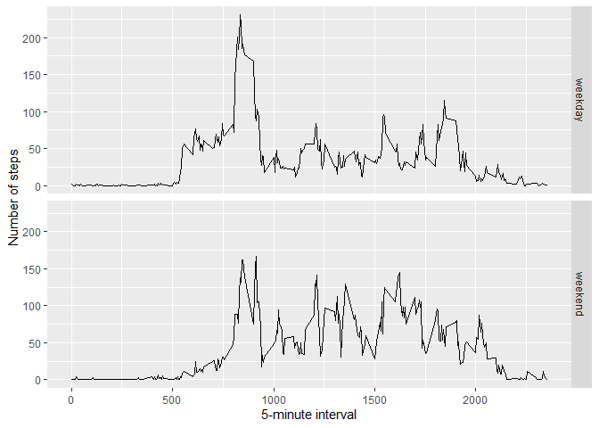

## Loading and preprocessing the data

```r
unzip(zipfile = "activity.zip")
data<-read.csv("activity.csv")
```

## What is mean total number of steps taken per day?

```r
library(ggplot2)
Steps.tot<-tapply(data$steps, data$date, FUN = sum, na.rm=TRUE)
qplot(Steps.tot, binwidth=1000, xlab="Total # of steps taken each day")
```

<!-- -->

```r
mean(Steps.tot, na.rm = TRUE)
```

```
## [1] 9354.23
```

```r
median(Steps.tot, na.rm = TRUE)
```

```
## [1] 10395
```


## What is the average daily activity pattern?

```r
library(ggplot2)
avgs<-aggregate(x=list(steps=data$steps), by=list(interval=data$interval),
                FUN=mean, na.rm=TRUE)
ggplot(data = avgs, aes(x=interval, y=steps)) +
  geom_line() +
  xlab("5-min int") +
  ylab("avg # of steps that was taken")
```

<!-- -->
  
On avg across all the days in dataset, the 5-minute interval contains the maximum number of steps?
  
  ```r
  avgs[which.max(avgs$steps),]
  ```
  
  ```
  ##     interval    steps
  ## 104      835 206.1698
  ```

## Imputing missing values

Lots of days/intervals that are missing values (coded as `NA`). The missing days may bring bias into some summaries or math of the data.


```r
mssg <- is.na(data$steps)

# The following shows how many are missing

table(mssg)
```

```
## mssg
## FALSE  TRUE 
## 15264  2304
```


Total of the missing numbers are filled in with mean value for that 5-minute

interval.


```r
# The following replaces the missing values with the mean values for the 5-minute interval

fill.value <- function(steps, interval) {

    filled <- NA

    if (!is.na(steps))

        filled <- c(steps)

    else

        filled <- (avgs[avgs$interval==interval, "steps"])

    return(filled)

}

filled.data <- data

filled.data$steps <- mapply(fill.value, filled.data$steps, filled.data$interval)
```

Through use of the filled data set, a histogram will be created of the total number of steps taken each day and calculate the mean and median total number of steps.


```r
total.steps <- tapply(filled.data$steps, filled.data$date, FUN=sum)

qplot(total.steps, binwidth=1000, xlab="Total # of steps taken each day")
```

<!-- -->

```r
mean(total.steps)
```

```
## [1] 10766.19
```

```r
median(total.steps)
```

```
## [1] 10766.19
```


The mean and median values are bigger after imputing missing data. The reason is

that in the original data, there are some days with `steps` values `NA` for 

any `interval`. The total number of steps taken in such days are set to 0s by

default. However, after replacing missing `steps` values with the mean `steps`

of associated `interval` value, these 0 values are removed from the histogram

of total number of steps taken each day.

## Are there differences in activity patterns between weekdays and weekends?

The day of the week is now to be found for each measurement in the dataset. The following we will use the dataset with the filled-in values.


```r
wkdy.or.wknd <- function(date) {

    day <- weekdays(date)

    if (day %in% c("Monday", "Tuesday", "Wednesday", "Thursday", "Friday"))

        return("weekday")

    else if (day %in% c("Saturday", "Sunday"))

        return("weekend")

    else

        stop("invalid date")

}

filled.data$date <- as.Date(filled.data$date)

filled.data$day <- sapply(filled.data$date, FUN=wkdy.or.wknd)
```


A panel plot that has plots of average number of steps taken

on weekdays and weekends.


```r
averages <- aggregate(steps ~ interval + day, data=filled.data, mean)

ggplot(averages, aes(interval, steps)) + geom_line() + facet_grid(day ~ .) +

    xlab("5-minute interval") + ylab("Number of steps")
```

<!-- -->
